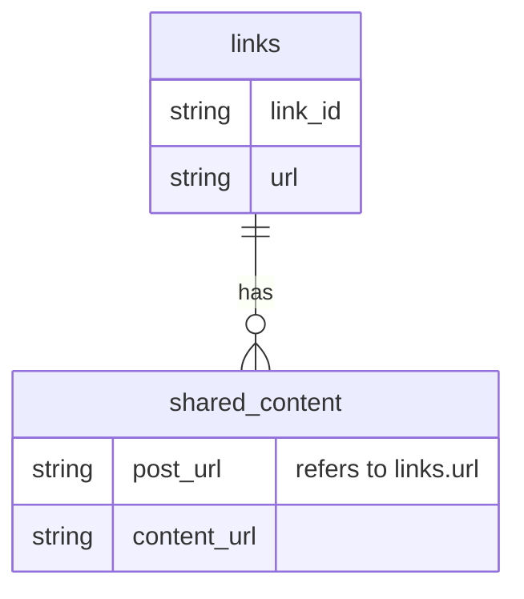

# minall

CLI tool and Python library to apply a suite of Minet's data-mining tools on a heterogenous set of URLs.

---

## Description

[`minet`](https://github.com/medialab/minet) is a Python library, maintained by the [médialab at Sciences Po](https://github.com/medialab/), that provides a suite of Python classes and functions to scrape data from the web and make API calls to various platforms. Normally to use `minet`, you call one of its CLI commands on a specific data set, such as a set of YouTube video IDs or a set of URLs from Instagram. What `minall` does is take advantage of `minet`'s many platform-specific tools and applies them to a heterogenous set of URLs, without needing to manually specify which API should be called. `minall` parses the input URL, activates the appropriate `minet` tools, and returns a unified set of metadata common to all the input URLs, which allows for comparative analysis.

## Install CLI / library

1. Create and activate a virtual Python environment, >= 3.11
2. Clone this repository and change into the newly created directory.
   ```shell
   git clone https://github.com/medialab/minall.git
   cd minall
   ```
3. Install the library in the activated virtual Python environment.
   ```shell
   pip install -e .
   ```

## Use as a CLI tool

```shell
usage: minall [-h] --input-links INPUT_LINKS [--input-shared-content INPUT_SHARED_CONTENT] --output-dir OUTPUT_DIR
              [--buzzsumo-only BUZZSUMO_ONLY] --config-file CONFIG_FILE

options:
  -h, --help            show this help message and exit
  --input-links INPUT_LINKS
  --input-shared-content INPUT_SHARED_CONTENT
  --output-dir OUTPUT_DIR
  --buzzsumo-only BUZZSUMO_ONLY
  --config-file CONFIG_FILE
```

At minimum, `minall` takes in a CSV of URLs (`--input-links`) and outputs two files: (1) a CSV of the same links but with metadata (`links.csv`) and (2) a CSV of the media content shared on various posts in the set of URLs (`shared_content.csv`).

<table>
    <tr>
        <th>link_id</th>
        <th>url</th>
    </tr>
    <tr>
        <td>1</td>
        <td>https://www.facebook.com/EmmanuelMacron/posts/889664472515470</td>
    </tr>
</table>



The two files will be output to a directory, whose path the user declares (`--output-dir`).

Optionally, if you already have a relational table of shared media content (`--input-shared-content`) whose metadata you want to update, you can provide that file as input too.

Finally, because `minall` makes API calls, it requires a JSON configuration file with multiple API keys. The model for this file is `minet`'s configuration file.

```json
{
  "buzzsumo": {
    "token": "MY_BZ_TOKEN"
  },
  "crowdtangle": {
    "token": "MY_CT_TOKEN",
    "rate_limit": 10
  },
  "youtube": {
    "key": "MY_YT_API_KEY"
  }
}
```

### Required format for the input CSV

The input files must conform to the output format's CSV headers.

`minall` produces a file of the input URLs with the following headers for the added metadata.

The input file must have, at minimum, the columns `link_id` and `url` and it cannot have any columns that are not part of `minall`'s [unified set](<(https://github.com/medialab/minall/blob/main/minall/links/constants.py)>) of metadata fields, shown below.

- `link_id` : some kind of unique identifier, which can refer to the URL or to some other entity to which the URL relates
- `url` : the URL that will be used for the metadata collection
- `domain` : the URL's domain name
- `type` : a [Schema.org](https://schema.org/CreativeWork) classification for the URL as a CreativeWork
- `duration` : if the URL is of a video, the video's duration
- `identifier` : the identifier given to the URL via a platform (i.e. YouTube ID, Twitter user ID)
- `date_published` : date (YYYY-MM-DD) when the URL's content was originally published
- `date_modified` : date (YYYY-MM-DD) when the URL's content was last updated
- `country_of_origin` : if the URL is of a YouTube channel, the channel's registered country
- `abstract` : abbreviated description of the URL's content
- `keywords` : keywords associated with the URL
- `title` : title given to the URL's content
- `text` : the URL's main textual content
- `hashtags` : hashtags associated with the URL
- `creator_type` : a [Schema.org](https://schema.org/creator) or [De Facto](https://github.com/AFP-Medialab/defacto-rss/blob/main/Defactor_rss.adoc) classification for the creator of the URL's content
- `creator_date_created` : if the URL's content was created by a social media account, the date of the account's creation on the site
- `creator_location_created` : if the URL's content was created by a social media account, the country in which the account is registered
- `creator_identifier` if the URL's content was created by a social media account, the social media platform's identifier for the account
- `creator_facebook_follow` : if the URL is a Facebook post, the number of Facebook followers the creator's account has
- `creator_facebook_subscribe` : if the URL is a Facebook post, the number of Facebook subscribers the creator's account has
- `creator_twitter_follow` : if the URL is a Tweet, the number of Twitter / X followers the creator's account has
- `creator_youtube_subscribe` : if the URL is a YouTube video, the number of YouTube channel subscribers the channel has
- `creator_create_video` : if the URL is a YouTube video, the number of videos the YouTube channel has created
- `creator_name` : the name of the creator of the URL's content
- `creator_url` : if the URL is a social media post, a link to the creator's account page on the platform
- `facebook_comment` : number of comments the URL has received on Facebook
- `facebook_like` : number of likes the URL has received on Facebook
- `facebook_share` : number of shares the URL has received on Facebook
- `pinterest_share` : number of shares the URL has received on Pinterest
- `twitter_share` : number of shares the URL has received on Twitter / X
- `tiktok_share` : number of shares the URL has received on TikTok
- `tiktok_comment` : number of comments the URL has received on TikTok
- `reddit_engagement` : metric engagement the URL has received on Reddit
- `youtube_watch` : number of views the URL has received on YouTube
- `youtube_comment` : number of comments the URL has received on YouTube
- `youtube_like` : number of likes the URL has received on YouTube
- `youtube_favorite` : number of favorite reactions the URL has received on YouTube
- `youtube_subscribe` : if the URL is of a YouTube channel, the channel's number of subscribers
- `create_video`: if the URL is of a YouTube channel, the number of videos the channel has created

A feature of `minall` is that it creates an in-memory SQL database during the enrichment process and updates any metadata provided at input. For example, if you have already used `minall` on a set of URLs and have collected metadata, you can update those metrics by inputting the enriched CSV file. This is useful because many metadata fields rely on Buzzsumo's aggregated database, whose API occasionally does not return good responses.
