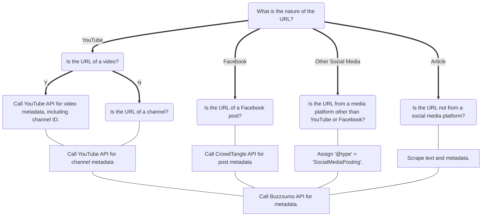

# Enrichment tools

---

::: minall.enrichment.enrichment
    handler: python
    options:
      show_root_heading: true
      show_source: true
      heading_level: 2

::: minall.enrichment.utils
    handler: python
    options:
      show_root_heading: true
      show_source: true
      heading_level: 2

::: minall.enrichment.article_text
    handler: python
    options:
      show_root_heading: true
      show_source: false
      heading_level: 2

::: minall.enrichment.article_text.scraper
    handler: python
    options:
      show_root_heading: true
      show_source: true
      heading_level: 3

::: minall.enrichment.article_text.get_data
    handler: python
    options:
      show_root_heading: true
      show_source: true
      heading_level: 3

::: minall.enrichment.article_text.constants
    handler: python
    options:
      show_root_heading: true
      show_source: true
      heading_level: 3

::: minall.enrichment.article_text.contexts
    handler: python
    options:
      show_root_heading: true
      show_source: true
      heading_level: 3
